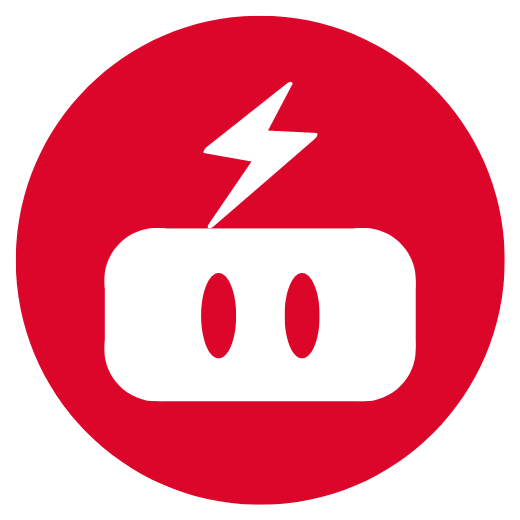
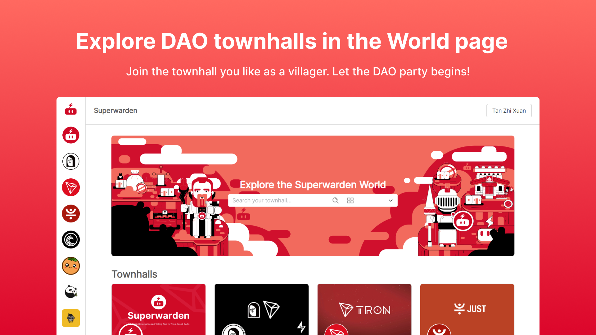
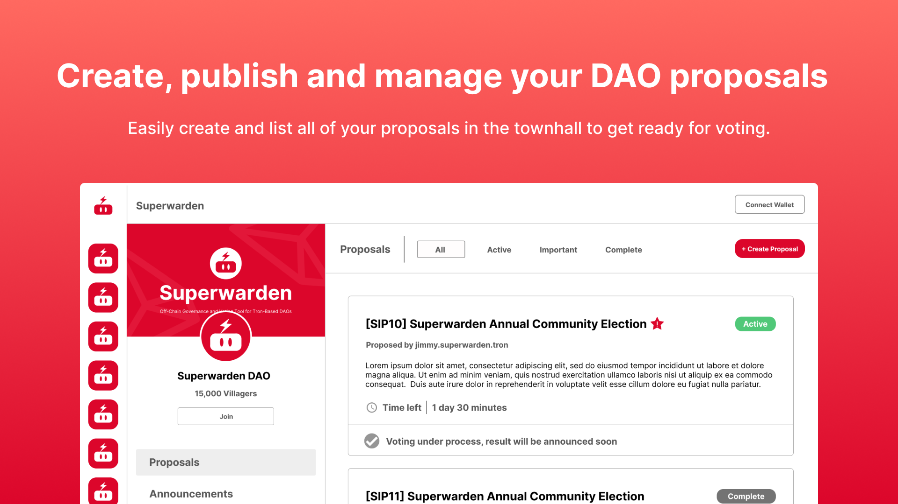
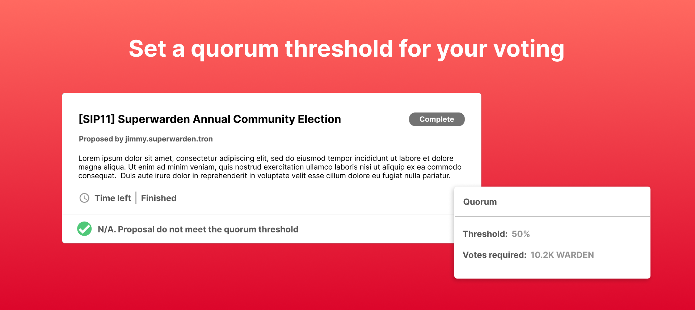
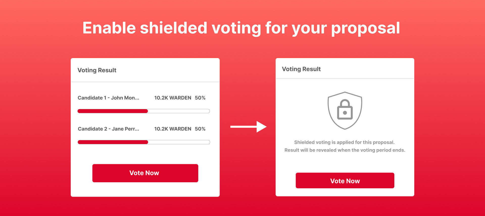
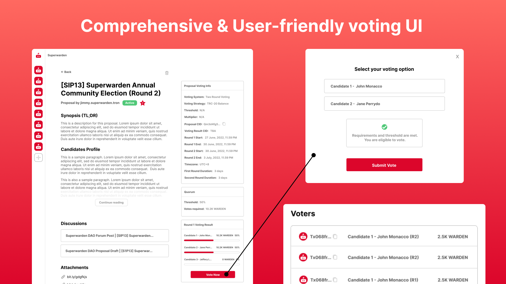
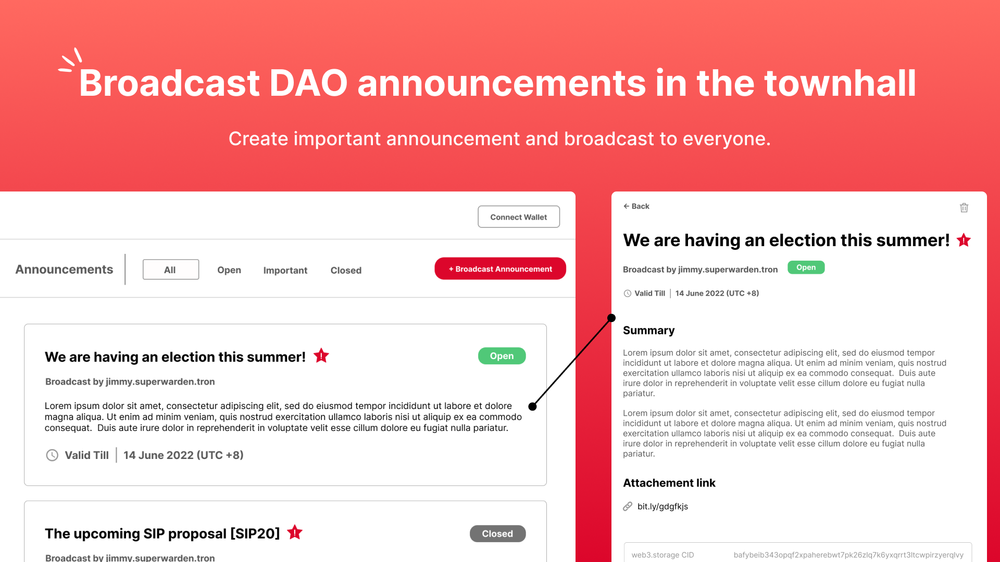
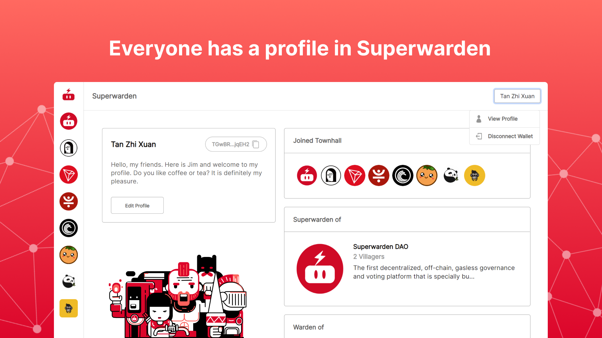

    
    <h1>Superwarden</h1>
    <strong>The Decentralised, Off-Chain, Gasless Governance & Voting Platform for TRON-Based DAOs.</strong>

 

## Introduction | TL;DR

**Superwarden is the first decentralized, off-chain, gasless governance and voting platform that is specially built for TRON-based DAOs.** It allows DAOs to build their own community townhall with custom branding, and manage their DAO activity in just one platform with a role-based management system. With its powerful and comprehensive voting system and built-in strategies, DAOs can set up and run their proposal voting dynamically with advanced customization. DAO members can easily participate in proposal voting on Superwarden, as the voting user interface is designed to be user-friendly (even for a complete novice in blockchain space). Furthermore, Superwarden's announcement broadcasting system also helps townhall community members to keep track of DAO activities efficiently. 

> 💡 In short, Superwarden is a powerful and comprehensive solution when comes to governance & voting in the TRON ecosystem. Now, it is **live on the TRON mainnet** and becoming the go-to choice for TRON-based DAOs!

##### 🔻 Core attributes

* **Decentralized**: Proposals, voting results and voters list, as well as DAO announcements, are fully stored on decentralized Web3.0 storage - IPFS (with the help of Web3.Storage and Pinata). Making everything easy to verify and hard to contest.

* **Off-chain**: All the activities in Superwarden are hosted off-chain to greatly reduce the cost of powering DAO activities with blockchain. However, we are interacting with data on the TRON blockchain and everything is decentralized and transparent. That's why TRC-10, TRC-20, and TRC-721 can be fully utilized for governance and voting purposes at Superwarden.

* **Gasless**: Say no to the high cost of gas fee! TRON-based DAOs can operate and run all the activities without any gas fee (free). There is also no burden for the community members to take part in DAO activities.

* **Open-Source with MIT license**: What does it mean when it is open-source and everyone can contribute to it? DAOs can build their own voting systems or features for certain purposes, and use them on Superwarden. It has endless possibilities and growing fast!

## What Superwarden does? | Features Overview

Here's the **features overview (TL;DR)** of Superwarden:

* Build Your Community Townhall
* Proposal | Voting System and Strategies
* Proposal | Community Voting
* Announcement Broadcasting
* Superwarden Profile System

### ✔️ Build Your Community Townhall

In Superwarden, townhall is a community space where all the DAO activities take place (such as proposal voting, announcement broadcast, etc.), and also where all the community members gathered and took part in the governance processes. Users can navigate and explore between different DAO's townhalls on the "World" page and add them to their own townhall sidebar when joined. Here, community members will be joining a DAO's community townhall as "**villagers**" role. By becoming a "villager" of a DAO's townhall, community members can view and vote on proposals, as well as keep track of announcement broadcasts. 

Everyone can create their own DAO's townhall with our powerful and comprehensive townhall creation process. Unlike some governance and voting tools in other blockchains which required users to buy an NFT domain from the native name service before opening up a space for their community, Superwarden makes townhall creation totally costless and easy. Every townhall created in Superwarden can have its own unique .tron slug which acts as a custom branding for DAO (without the need of name service, as well as complicated setup and integration). After providing all the details needed in the multi-step townhall creation process (which takes a couple of minutes), your townhall is all set and ready to go!

Worth mentioning that Superwarden is using a **role-based management system** for townhall operations. The creator or owner of a townhall has the role of "**superwarden**" (similar to the name of this application), which is the super admin of the townhall and has the highest control and accessibility. "Superwarden" of a townhall can then assign "**wardens**", which have the ability to create proposals, broadcast announcements, and assign "masters". Here, "**masters**" are the ones who are assigned to create and publish proposals that have passed in forum discussion, in order for all of the townhall members to vote. 

### ✔️ Proposals | Voting System & Strategies

Creating proposal voting in Superwarden is easy and fast with its multi-step process:

> **Provide proposal's general info \> Edit proposal content with our Markdown editor \> Choose a voting system \> Choose a voting strategy \>  Voting strategy settings \> Set up date and time \> Publish and ready to go!**

Superwarden provides various types of voting systems and voting strategies for DAOs when conducting proposal voting. The voting systems are a set of rules which how the proposal voting is going to be conducted, while voting strategies determine how the voting power and results are calculated. Worth mentioning that, in Superwarden, DAO has much flexibility and easiness to choose the right voting systems and voting strategies for its upcoming proposal, as simple as just selecting during the proposal creation (without the need to update the DAO setting every time). 

Here is a quick overview of all the voting systems and voting strategies in Superwarden 👇:

**<u>Voting Systems</u>**

* **Single Choice Voting**: Each voter can only vote for one candidate or choice. It is ideal for a scenario where a voter needs to choose one option from many.

* **Approval Voting**: Each voter can vote or “approve” multiple choices. Note that each selected choice will receive equal voting power.

* **Two-Round Voting**: A single-choice voting system with two rounds. The two candidates or choices who received the most votes in the first round will enter the second round of voting.

**<u>Voting Strategies</u>**

* **TRC-10 Balance**: The balance of TRC-10 token in the voter’s wallet will be used to calculate the voting result. One token represents one vote (1T1V).

* **TRC-10 Balance with Threshold**: In order to vote, the balance of TRC-10 token in the voter’s wallet need to be equal or greater than the minimum threshold set. 

* **TRC-20 Balance**: The balance of TRC-20 token in the voter’s wallet will be used to calculate the voting result. One token represents one vote (1T1V).

* **TRC-20 Balance with Threshold**: In order to vote, the balance of TRC-20 token in the voter’s wallet needs to be equal to or greater than the minimum threshold set. 

* **TRC-721 (NFT) Voting**: The amount of TRC-721 token (NFT) in the voter’s wallet will be used to calculate the voting result. One token represents one vote (1T1V).

* **TRC-721 Voting with Multiplier**: The voting power of each TRC-721 token (NFT) will be multiplied by a multiplier, and will be used to calculate the voting result.

* **Whitelist Voting**: The proposal creator will upload a whitelist with eligible wallet addresses in it. Voters in the whitelist can vote on the proposal. Each voter will have a voting ticket with a custom symbol. One person represents one vote (1P1V) and it is single-choice voting.

####  <u>Superwarden supports Quorum</u>

Furthermore, **Superwarden does let proposal creator set up their proposal quorum** by indicating the quorum percentage and token circulating supply. A quorum is a minimum number of participating members(or in most cases, tokens) required for a governing body to approve a proposal. 

> For example: If a quorum is set to 50%, this means that 50% of all circulating tokens need to vote yes for the proposal to pass. This gets confused meaning that the proposal will pass with 50% of the voters choosing yes. The calculation looks at the circulating supply and requires that 50% of all the tokens need to choose yes for the proposal to pass. Even if 50% of all tokens participate, if 1 token vote for no, that vote will not pass.

Having a quorum is important in DAO's proposal voting to prevent some major risks (related to treasury and governance).  The quorum threshold and the votes required for a proposal to be approved will be displayed on the proposal's page as a reference for voters. If the proposal voting is ended but the votes don't pass the quorum threshold, Superwarden will mark and display the status as: "N/A. Proposal do not meet the quorum threshold".

####  <u>Superwarden's Shielded Voting</u>

Besides that, Superwarden has introduced a new concept in DAO's proposal voting, which is called the **Shielded Voting**. In short, votes (voters list) and voting results are shielded throughout the voting period, and only will be revealed when the voting period is over. **There are some benefits when DAO enable Superwarden's shielded voting for their proposal voting**:

* **Pre-voting information symmetry**: One bases their vote on their current understanding of the issue while making a vote. But at that time, another individual may have a very different experience. The individual who votes first has a completely different perspective from the one who votes last if the most recent voting result is available. The last voter would be aware of how other people have voted thus far, which may influence their decision. This sort of information asymmetry can be overcome through Superwarden's shielded voting. The same information should be available to all participants. Whether the details are shared in a public forum or just the poll description. The fairness of the governance decisions is improved by upholding the notion of each voter having equal access to information.

* **Partial privacy**: Public blockchains, like TRON, are by their very nature pseudo-anonymous. This characteristic makes sure that addresses can already largely conceal a person's identity. Superwarden brings this to the next level by keeping the votes secret until the end of the voting session. So-called secret votes are made possible by this limited level of secrecy throughout the voting process. Until the voting ends and the results are made public, the number of votes submitted and the status of the vote are kept a secret. Except for the voter, no other participant can see who cast what votes prior to the revelation.

* **Prevent voter apathy and misbehavior**: If they believe their participation won't have an influence, people often follow the crowd or choose not to participate. By concealing the information, Superwarden's shielded votes dramatically decrease these problems and improve fairness. The setting is more impartial for the voters when just a partial vote total is known. Voters are more honest since they aren't affected by previously cast votes, which increases the integrity of the vote. One isn't convinced to vote for the popular option since they can't observe how the vote is doing. Additionally, voters aren't deterred from casting a ballot since the majority has already voted in a manner that differs from their own choice.

* **Improved outcomes in voting**: The benefits of applying shielded voting in Superwarden mentioned above can greatly increase the quality of the outcomes in proposal voting, leading to better governance in TRON-based DAOs.

### ✔️ Proposals | Community Voting

Proposals created on Superwarden will be all listed in the townhall, with statuses of: `active`, `important`, and `complete`. All of the proposal's countdown and results will also be announced and displayed here. Community members can easily keep track of active (or important) proposals to vote on. For detailed proposal voting info and a summary (content) of the proposal, community members just have to tap into the proposal's individual page to check it all. Furthermore, a community member can also place their vote on the proposal's individual page too, by just clicking on "vote now", choose the voting options to vote, and submit his/her vote. **Voting is that simple on Superwarden!** The votes will be recorded into the voters' list, this includes the wallet address of the voter, the voting option of the voter, and the votes (tokens or tickets) count contributed to the voting option.

Worth mentioning that, when the proposal is created, an identical copy will be stored on IPFS (stored on Web3.Storage, plus additional pinning on Pinata) and the CID will be displayed on the proposal's individual page as a reference. When the proposal voting ended, the voting result and voters' list will also be stored on the IPFS (stored on Web3.Storage, plus additional pinning on Pinata), and return a CID for future reference. **Voting on Superwarden is transparent and the result is hard to contest with the help of decentralized Web3.0 storage!**

### ✔️ Announcement Broadcasting

Townhall can broadcast announcements related to DAO events, notices or messages, upcoming proposals, etc.  All of the announcements will be listed in the townhall for all the community members to keep track of. During the announcement creation, a valid date can be set to the announcement to let the user know when is the announcement valid till. This can efficiently prevent community members from following outdated announcements and cause misunderstanding. An announcement can also be marked as `important` to let community members pay more attention to it. Worth mentioning that all of the broadcasted announcements will have a copy uploaded and stored on IPFS (stored on Web3.Storage, plus additional pinning on Pinata). Every announcement's individual page will have a CID of itself which can be referred to on IPFS.

### ✔️ Superwarden's Profile System

Superwarden's profile system further increases the transparency in all of the DAO activities. Every user has a profile that: records all of the roles assigned to the user by any townhalls, showing the townhall created by the user, and a profile card showing the address, name, and bio of the user. In the next release, the user's Superwarden profile will also display a voting timeline that tracks all the proposal voting records of the user, as well as the participation rate in DAO activities of each townhall.

